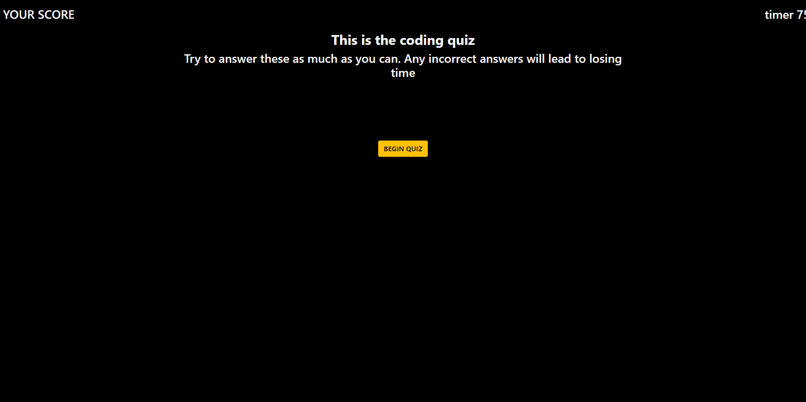

# javascript-quiz-project

## JAVASCRIPT QUIZ GAME PROJECT

# ==================================================
## Introduction
This assignment was to create a Javascript Quiz Game that would populate a quiz on a static HTML page that you could navigate through and gain points by answer correctly and lose points by getting the wrong answer. I created an extra step to the process by giving bonus points to a user for finishing in a quicker amount of time based on time left as a score multiplier. Before I started this quiz I reviewed everything I could for three full days prior to beginning as this class is the first experience I've had with javascript.

# ==================================================
## Approach
For this assignment I knew that I had the tools (after much review) to start in earnest using the tools I had available to me from practice on re-creating in class assignments and  outside research. I pseudo coded and created a strategy document to outline how I would approach creating this project before beginning.

Step 1. Creating a static HTML & CSS page with some elements I could hide & unhide depending on the status of the quiz being taken.

Step 2. Creating global variables that I could target and map quiz content onto easily and that I could apply values to later on in the project. 

Step 3. Creating a time that is responsive to wrong answers by losing time when an incorrect answer is selected.

Step 4. The quiz game itself relies on an array of objects that I access for content generation & a set of if/else statements on every button that correspond to when it will be a correct answer on a page.

Step 5. Creating an object for the high scores to go into through a submit button & then having them show up once that button is clicked.

Step 6. Clearing scores dynamically from the page and returning to the beginning of the quiz.

# ==========================================================
# Considerations & Areas of Growth
After working on this project and gaining a stronger understanding of javascript, if I had more time I would have done all of my coding dynamically & made more use of LOOPs to place quiz answer content inside of buttons instead of explicitly writing it out for ever button position and condition. 

While my project works & looks great, I believe that had I had an extra day I would have worked that into my project more, but I knew that I would struggle with setting and retrieving items from local storage as this is the area I had the least amount of practice & research time in at the time of this project's assignment. I am glad that I moved forward with my work strategy as I did because I was able to spend a majority of this project on building a more full and thorough understanding of accessing local storage and using it efficiently. 

# =============================================================
# Many Thanks

I want to give many thanks to my fellow classmates for being in the struggle with me & spending most of a holiday weekend working on learning and striving to be better developers in this full time & aggressively paced program. Having a space with other folks on your level to talk about code & run experiments with and debug issues or just ride the wave of the successes and failure of coding makes this process of improvement and discovery even better.

I want to also thank my instructor & the TA's for being professionals & doing a great job of asking questions and helping us discover answers on our own. 